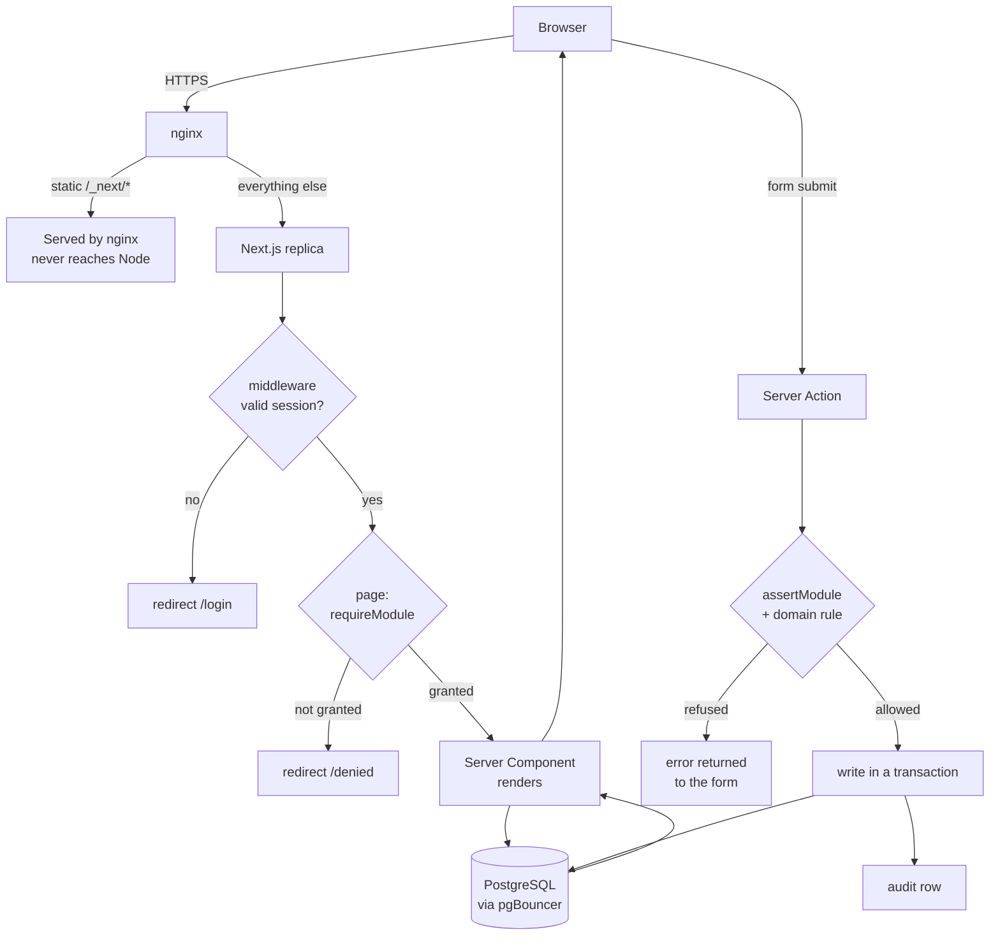

# 02 — Application Architecture

## The stack, and why each piece

| Layer | Choice | Why this one |
|---|---|---|
| Framework | **Next.js 15** (App Router, Server Actions) | Server-rendered pages mean the browser never holds the data model, so an access check cannot be bypassed by editing client state. Server Actions remove a whole REST layer that would only re-implement the same checks. |
| UI | **React 19** + **Tailwind CSS 4** | Tailwind's logical properties (`ms-`, `me-`, `border-e`) mirror correctly for Arabic without a second stylesheet. |
| Database | **PostgreSQL 16** | Real concurrency, real types, real backups, and one engine in every environment. |
| ORM | **Prisma 6** | Typed queries and a real migration history. Every query is parameterised, so SQL injection is structurally absent — there is no raw SQL anywhere in the app. |
| Auth | **jose** (JWT) + **bcryptjs** | A signed, httpOnly cookie. No session table to grow, no session store to run. |
| Validation | **zod** | Input is validated at the edge of every server action. |
| Excel | **exceljs** | Real `.xlsx` workbooks — multiple sheets, frozen headers, and Arabic text that survives without an import wizard. |
| Tests | **Playwright** + `node --test` | The suites drive the real browser, because the thing worth testing is the refusal, not the function call. |

## Request lifecycle



The two paths matter. A **page** is a read and redirects when refused. A
**server action** is a write and returns an error. They are separate entry
points and each carries its own check — a page-only check would be a door with a
lock on the outside.

## Code layout

```
src/
├── middleware.ts              coarse gate: signed in, or not
├── app/
│   ├── login/                 sign-in (public)
│   ├── denied/                "you do not have this module"
│   ├── api/health/            liveness + readiness (public, says nothing else)
│   └── (app)/                 the signed-in application
│       ├── layout.tsx         sidebar, built from the user's granted modules
│       ├── dashboard/         role-specific summaries
│       ├── users/  access/    accounts and the access grid
│       ├── academic/ classes/ students/ assignments/
│       ├── attendance/        the supervisor's daily register
│       ├── periods/           the school day (admin)
│       ├── period-attendance/ the teacher's live register
│       ├── observations/  tasks/
│       ├── reports/           attendance + observations, CSV/Excel
│       ├── period-reports/    by period/day/class, Excel
│       └── audit/             the history
└── lib/
    ├── constants.ts           roles, modules, default grants  ← source of truth
    ├── auth.ts                session → user → resolved rights
    ├── session.ts             JWT sign/verify, cookie options
    ├── db.ts                  the one Prisma client
    ├── dates.ts               day keys, and the school's "today"
    ├── school-time.ts         the school's wall clock; which period is live
    ├── periods.ts             period queries + THE write rule
    ├── queries.ts             shared reads and report aggregates
    ├── reports.ts             report scope + CSV
    ├── audit.ts               the append-only history writer
    ├── rate-limit.ts          login brute-force brake
    ├── i18n.ts                both dictionaries + interpolation
    └── xlsx.ts                workbook builder
```

Two conventions hold this together:

- **One rule, one place.** `resolvePeriodWriteAccess()` decides who may write a
  period register. The page calls it to decide whether to render a save button;
  the server action calls it to decide whether to accept the post. They cannot
  disagree, because they are the same function.
- **Scope resolution is shared.** `resolveReportScope()` and
  `resolvePeriodReportScope()` turn a query string into the classes a person may
  actually see. The page and the export route both call it, so an export can
  never widen scope.

## The data model

```mermaid
erDiagram
    User ||--o{ UserModuleAccess : "overrides"
    User ||--o{ ClassSupervisor : supervises
    User ||--o{ ClassTeacher : teaches
    User ||--o{ Student : "parent of"
    User ||--o| Student : "is"
    User ||--o{ Attendance : recorded
    User ||--o{ PeriodAttendance : recorded
    User ||--o{ Observation : wrote
    User ||--o{ Task : assigned
    User ||--o{ AuditEvent : did

    AcademicYear ||--o{ Term : has
    AcademicYear ||--o{ Class : has

    Class ||--o{ Student : holds
    Class ||--o{ ClassSupervisor : "has supervisor"
    Class ||--o{ ClassTeacher : "has teacher"
    Class ||--o{ Attendance : "daily register"
    Class ||--o{ PeriodAttendance : "period register"
    Class ||--o{ Observation : notes

    Student ||--o{ Attendance : "one per day"
    Student ||--o{ PeriodAttendance : "one per period per day"
    Student ||--o{ Observation : about

    Period ||--o{ PeriodAttendance : "register for"

    RoleModuleAccess }o--|| Role : "grants per role"
```

### The tables

| Table | Holds | Key constraint |
|---|---|---|
| `User` | Everyone, with a role and up to 3 phone numbers | `email` unique |
| `RoleModuleAccess` | The (role × module) grid | unique `(role, module)` |
| `UserModuleAccess` | Per-person overrides; null means inherit | unique `(userId, module)` |
| `AcademicYear` / `Term` | The school calendar | one year `isCurrent` |
| `Class` | A class of one year | unique `(academicYearId, name)` |
| `Student` | The student record + guardian contact | `code` unique |
| `ClassSupervisor` / `ClassTeacher` | Who covers what | unique `(classId, userId)` |
| `Attendance` | The daily register | **unique `(studentId, date)`** |
| `Period` | A slot of the school day | `name` unique |
| `PeriodAttendance` | The period register | **unique `(studentId, date, periodId)`** |
| `Observation` | Dated notes | indexed by class+date, student |
| `Task` | Staff work | indexed by assignee+status |
| `AuditEvent` | Append-only history | actor's *name* copied in |

The two unique constraints in bold are the integrity of the whole product: they
make a double-save idempotent instead of duplicating a student's attendance.
Both registers are written with `upsert`, so re-submitting a form corrects the
row rather than adding another.

### Two deliberate modelling decisions

**Enums are strings, not native Postgres enums.** Every value is validated
against `src/lib/constants.ts` at the edge, and the constants are the source of
truth for the UI, the labels and the translations. A native enum would move the
truth into the database and turn "add a status" into a table-locking migration.

**Period times are `"HH:MM"` strings, not timestamps.** A timetable is a fact
about the clock on the wall — "period 1 starts at 08:00" — not an instant.
Stored as a timestamp it would drift when the clocks change.

## Time — the thing that is easy to get wrong

Three different clocks are involved, and conflating any two produces a bug that
only appears at certain hours:

| Clock | What it is | Where it is used |
|---|---|---|
| **UTC** | What the server runs in | Storage. Every school day is stored as UTC midnight, so a day key is stable. |
| **School time** | `SCHOOL_TIMEZONE`, `Asia/Bahrain` | *All* logic. Which period is live, and what "today" means. |
| **Browser local** | Whatever the user's device says | Nothing. Deliberately never trusted. |

`schoolClock()` resolves the school's date and minute-of-day through `Intl` in
the configured zone. `today()` is built from it. Both future-date guards compare
against it.

> This was a real defect. There were two definitions of "today" — one built from
> the server's *local* clock, one from *UTC* — and neither was the school's. On
> a Bahrain deployment that refuses a valid register between midnight and 03:00,
> and it made the test suite fail at those hours. Fixed 2026-08-29.

## The security model

### Authentication

Password → bcrypt (cost 10) → signed JWT → httpOnly cookie, 8 hour expiry.

```
httpOnly: true          JavaScript cannot read it, so XSS cannot steal it
sameSite: "lax"         a cross-site POST cannot carry it
secure: true            (production) never sent over plain HTTP
path: "/"
maxAge: 8 hours
```

There is no session table. The cookie *is* the session, and revocation is by
deactivating the account — checked on every request, because `getCurrentUser()`
re-reads `isActive` from the database rather than trusting the token.

**The signing key is guarded at startup.** In production the app refuses to boot
if `AUTH_SECRET` is still the example value from `.env.example`, or is shorter
than 32 characters. Anyone who has read this repository could otherwise mint an
administrator session, and nothing about the running app would look wrong. A
server that will not start is a far cheaper failure than one that is quietly
forgeable.

### Brute force

Two independent brakes:

1. **Per account** — five failed attempts locks that account temporarily. A
   success clears the counter, so a typo costs nothing.
2. **Per IP, at nginx** — 10 requests/minute to `/login`, burst 5.

The first stops someone guessing one person's password. The second stops
someone spraying one password across every account.

### Authorisation

Three layers, described above. The default is **deny**: a module with no row is
no access, and `resolveAccess()` starts from a fully-denied map and only ever
adds.

### What is exposed

| Surface | Exposure |
|---|---|
| `/login` | Public, rate-limited |
| `/api/health` | Public, returns only `ok`/`down` — no version, host or connection string |
| Everything else | Session required, then module required |
| PostgreSQL | **Not on the internet.** Private network only |
| pgBouncer | **Not on the internet.** Private network only |
| SSH | Key only, root login disabled |

### Headers

Set by the application, so they survive a proxy change, with HSTS added by
nginx which owns TLS: `Content-Security-Policy` (no external origins at all — no
CDN, no third-party scripts, no external fonts), `X-Frame-Options: DENY`,
`X-Content-Type-Options: nosniff`, `Referrer-Policy`, `Permissions-Policy`.

## Testing

| Suite | What it proves | Count |
|---|---|---|
| `npm run test` | Rate-limit logic in isolation | 4 |
| `npm run test:i18n` | Both dictionaries agree; no key half-translated | 10 |
| `bash scripts/smoke.sh` | The full (role × page) access matrix | 7 × 16 |
| `npm run test:ui` | Every interactive flow, in Chromium | 39 |
| `npm run test:periods` | The period feature, including the time window | 16 |

The browser suites **pin the interface to English** with a cookie, because the
app now opens in Arabic and every text selector would otherwise be looking for a
string the page does not render.

Both `smoke.sh` and `ui-test.ts` judge a refusal by **what the page shows**, not
by its status code — a production server answers `redirect("/denied")` with a
307 and `notFound()` with a 404, but the dev server has already started
streaming and answers **200** with the refusal in the body. Checking the status
alone scored every blocked page as "ok".
