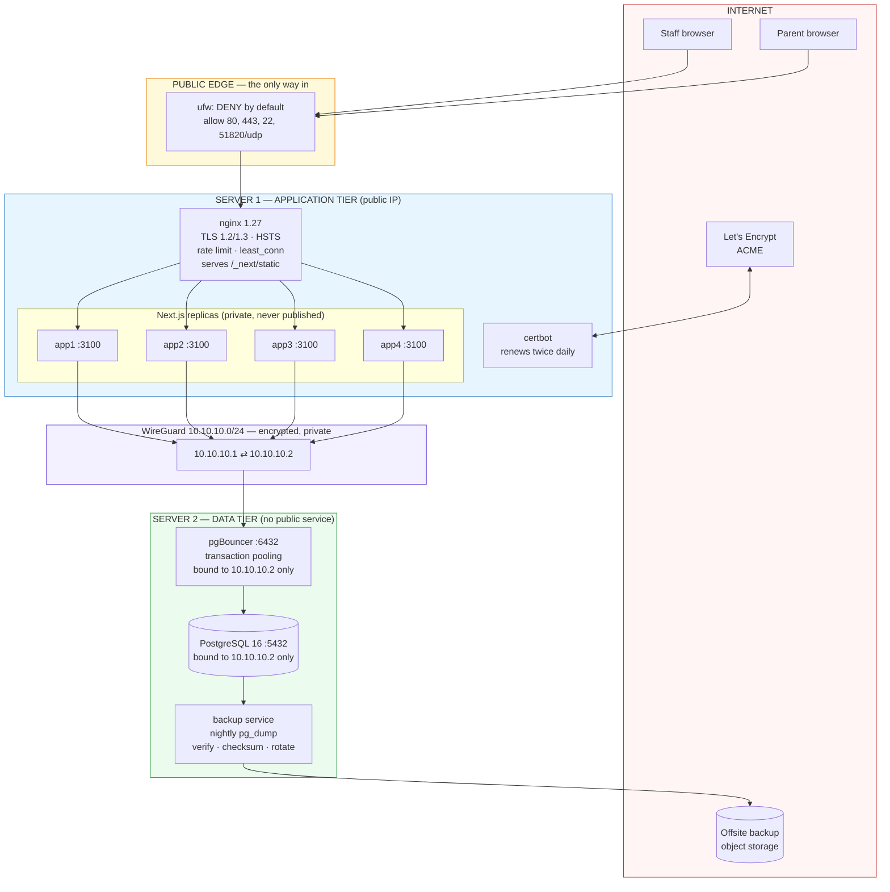
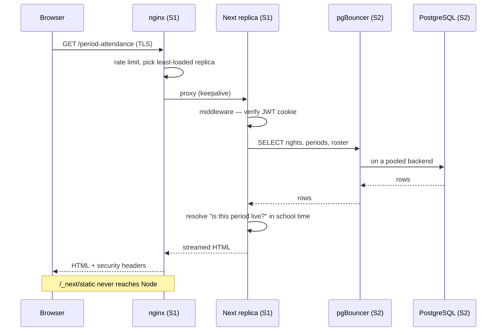
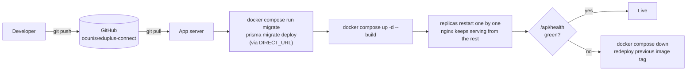

# 03 — Infrastructure

> **Status: PLANNED.** Everything in this document is designed and written as
> runnable configuration in `deploy/`, but has not yet been executed against
> real hardware — the servers are not bought at the time of writing. Nothing
> here is described as working. See [06 — Status](06-status.md).

## The shape of it

Two servers. One runs the application, one runs the database. They are joined by
an encrypted private network, and only the application server is reachable from
the internet, on two ports.

### Why two servers and not one

One server would be cheaper and simpler. Two is chosen for three reasons:

1. **Blast radius.** The application is the part exposed to the internet and the
   part that gets deployed weekly. The database is neither. Separating them
   means a compromised or wedged app server does not sit on the same kernel as
   the school's data.
2. **Resource contention.** Postgres wants page cache and predictable I/O; Node
   wants CPU. On one box a heavy report starves the thing generating it.
3. **They fail differently.** The app can be rebuilt from git in minutes. The
   database cannot be rebuilt from anything but a backup.

The honest counter-argument: two servers doubles the number of machines to
patch, and a private network is one more thing to get wrong. That is accepted,
and it is why `bootstrap-server.sh` exists — the hardening is scripted, not
remembered.

## The servers

**Assumption — confirm at purchase.** The figures below are what was discussed
(2 × VPS, ~$30/month each). The exact specification must be read off the
Contabo order page and corrected here before deployment.

| | Server 1 — APP | Server 2 — DB |
|---|---|---|
| **Role** | nginx + Next.js replicas | PostgreSQL + pgBouncer + backups |
| **Provider** | Contabo *(to confirm)* | Contabo *(to confirm)* |
| **Product** | Cloud VPS *(to confirm)* | Cloud VPS *(to confirm)* |
| **vCPU** | ~12 *(to confirm)* | ~12 *(to confirm)* |
| **RAM** | ~24–48 GB *(to confirm)* | ~24–48 GB *(to confirm)* |
| **Disk** | NVMe/SSD *(to confirm)* | NVMe/SSD *(to confirm)* |
| **OS** | Ubuntu 24.04 LTS | Ubuntu 24.04 LTS |
| **Public IP** | Yes | Yes *(SSH only; no public service)* |
| **Private IP** | 10.10.10.1 (WireGuard) | 10.10.10.2 (WireGuard) |
| **Cost** | ~$30/month | ~$30/month |

**Total: ~$60/month**, plus a domain (~$10–15/year) and offsite backup storage
(a few dollars a month).

### What "shared vCPU" means, honestly

Contabo Cloud VPS gives large specifications cheaply because CPU time is shared
with other tenants on the same physical host. **Your RAM, disk and IP are
yours; CPU throughput and disk I/O can fluctuate** depending on what neighbours
are doing. No other tenant can read your files.

The practical consequence: performance is good but *less predictable* than a
dedicated-CPU or bare-metal server. For a school of this size that is a
reasonable trade at the price. The upgrade path, if it ever bites, is to move
the **app** server to a dedicated-CPU product first — it is stateless and can be
replaced in minutes, whereas moving the database means a maintenance window.

This is a deliberate, reversible choice, not an oversight.

### Why the database server also has a public IP

It needs one to receive its own OS security updates and to be reachable by SSH
for administration. It runs **no public service**: `ufw` denies everything
except SSH and the WireGuard port, and Postgres and pgBouncer are bound to the
WireGuard address, so they are not listening on the public interface at all.
Two independent locks on the same door.

## The private network

WireGuard, `10.10.10.0/24`. Modern, small enough to audit, in the mainline
kernel, and it survives an IP change — which matters because Contabo can move a
VPS.

| | Address | Role |
|---|---|---|
| App server | `10.10.10.1` | WireGuard peer |
| DB server | `10.10.10.2` | WireGuard peer |
| Port | `51820/udp` | Both |

All database traffic crosses it. Postgres' own TLS is therefore not required —
the transport is already encrypted and authenticated, and the only two machines
on the network are these two.

## Firewall

Default **deny** inbound on both.

| Port | App server | DB server |
|---|---|---|
| 22/tcp SSH | Open *(key only, root disabled)* | Open *(key only, root disabled)* |
| 80/tcp HTTP | Open — ACME + redirect to HTTPS | **Closed** |
| 443/tcp HTTPS | Open | **Closed** |
| 51820/udp WireGuard | Open | Open |
| 5432/tcp Postgres | — | **wg0 only** |
| 6432/tcp pgBouncer | — | **wg0 only** |
| Everything else | Denied | Denied |

`fail2ban` watches SSH. nginx rate-limits the application.

## Software inventory

| Service | Version | Where | Why it is there |
|---|---|---|---|
| nginx | 1.27-alpine | App | TLS termination, load balancing, rate limiting, static caching |
| Next.js app | Node 22-alpine | App × 4 | The application. Node is single-threaded per process, so one container = one core; four replicas is how a 12-vCPU box gets used |
| certbot | latest | App | Renews the certificate twice daily |
| PostgreSQL | 16-alpine | DB | The database |
| pgBouncer | latest | DB | Transaction pooling |
| backup | postgres:16-alpine | DB | Nightly verified dump, rotation, offsite copy |
| Docker Engine | latest stable | Both | Same image everywhere; one-command rollback |
| WireGuard | kernel | Both | The private network |
| ufw / fail2ban | distro | Both | Firewall and SSH brake |
| chrony | distro | Both | **Clock accuracy** — the entire period feature depends on the time being right |

### Why pgBouncer is not optional

Next opens a connection pool **per server process**. Four replicas, each holding
8 connections, is 32 client connections; without a pooler each would be a real
Postgres backend, each reserving its own `work_mem`. Scale to eight replicas and
Postgres falls over long before the CPU is busy.

pgBouncer in **transaction** mode folds those onto ~25 real backends, handed out
per transaction. That is the single most important capacity decision in this
design.

It carries one constraint, which the configuration already handles: transaction
pooling cannot support named prepared statements, so `DATABASE_URL` must carry
`pgbouncer=true`. Without it you get `prepared statement "s0" already exists`
— intermittently, under load, which is the worst way to find out.

Migrations bypass the pooler entirely (`DIRECT_URL`), because they need a real
session.

## Data flow: one page request

## Deployment flow

Rollback of **code** is redeploying the previous image. Rollback of a
**migration** is not automatic and never should be — see
[04 — Operations](04-operations.md#restoring).

## What this design does not give you

Stated plainly, because a diagram that hides its weaknesses is decoration:

- **No high availability.** One app server and one database server. If the app
  server dies, the site is down until it is rebuilt or replaced. If the database
  server dies, the site is down until it is restored from backup. This is a
  deliberate cost decision at $60/month.
- **Recovery is measured in hours, not seconds.** RTO ≈ 1–4 hours (rebuild and
  restore). RPO ≈ up to 24 hours (nightly dump) — reducible to minutes by
  enabling WAL archiving, which is the recommended first upgrade.
- **No read replica.** Every query hits the primary.
- **No CDN.** nginx serves static assets directly. Fine for a single school.
- **Backups are only as good as the last restore test.** The script verifies
  every dump is readable, but a scheduled restore rehearsal is on the roadmap
  and is not yet a habit.

The upgrade path for each of these is in [06 — Status](06-status.md#roadmap).
