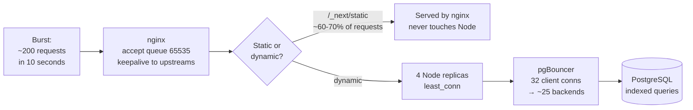

# 05 — Capacity and Performance

> **Status: ESTIMATED, not measured.** No load test has been run against real
> hardware. This document shows the reasoning and states plainly what is
> assumption. It must be replaced with measurements after the servers exist —
> see [the load test plan](#the-load-test-that-must-happen) below.

## The stated target

> "handle more than 4000 reqs in same time sometimes or more or less"

That sentence has two readings, and they are wildly different engineering
problems. Getting this right is the difference between a sound design and
buying the wrong servers.

| Reading | Meaning | Difficulty |
|---|---|---|
| **4000 requests per second** | Sustained throughput | Very hard. Needs many app servers, a CDN, heavy caching, probably read replicas. Not a $60/month system. |
| **4000 concurrent users** | 4000 people with the page open | Hard, but mostly an idle-connection problem. |
| **4000 requests arriving in the same burst** | e.g. everyone opens the register at 08:00 | **Realistic, and what this design targets.** |

**The third is almost certainly the real requirement**, and here is why: a school
does not generate steady traffic. It generates *spikes* — the start of a period,
when every teacher opens their register within the same two minutes.

### What this school actually generates

Let us size it from the domain rather than from a number in a sentence.

**Assumption — confirm with the school:**

| Quantity | Assumed |
|---|---|
| Students | 500–2000 |
| Teaching staff | 40–150 |
| Classes | 20–80 |
| Periods per day | 7 |
| Parents who log in daily | 10–20% of families |

**The worst moment of the day** is the start of a period: every teacher opens
`/period-attendance`, marks a register, and saves.

```
150 teachers × ~4 requests (page, save, confirm, dashboard)
  = ~600 requests
  arriving within ~120 seconds
  ≈ 5 requests/second average
  with a peak burst of perhaps 100–200 requests in the first 10 seconds
```

**That is two orders of magnitude below 4000 requests/second.** The design
target is therefore not throughput — it is *absorbing a burst without
queueing*, which is a different and much more tractable problem.

## Where the capacity actually comes from



Four things carry the load, in order of how much they contribute:

**1. nginx serves the static assets.** Next's build output is content-hashed and
immutable. On a typical page load the majority of requests are JS, CSS and
images — and none of them reach Node. This is the single biggest win and it
costs one `location` block.

**2. Four Node replicas, not one.** Node is single-threaded per process. One
container uses one core no matter how many the VPS has. Four replicas behind
`least_conn` is how a 12-vCPU box is actually used. `least_conn` rather than
round-robin matters here: server-rendered pages vary a lot in cost, and
round-robin will queue a request behind a slow report while another replica
sits idle.

**3. pgBouncer collapses connections.** Without it, 4 replicas × 8 connections
would be 32 real Postgres backends, each reserving `work_mem`. With transaction
pooling they become ~25 shared backends handed out per transaction. This is
what stops the database falling over before the CPU is busy.

**4. The queries are indexed for the access patterns.** Every hot path —
`(classId, date, periodId)`, `(studentId, date)`, `(date, periodId)` — has a
covering index, and the report aggregates are `groupBy` in the database rather
than rows pulled into Node.

## Rough numbers, and their basis

**These are estimates. Treat them as hypotheses to test, not as facts.**

| Path | Estimate | Basis |
|---|---|---|
| Static asset (nginx) | < 5 ms | Served from page cache; no application involved |
| Simple page (dashboard) | 50–150 ms | 2–4 indexed queries + React render |
| Period register (30 students) | 80–200 ms | Roster + existing rows + render |
| Save a register | 100–250 ms | One transaction of ~30 upserts |
| Report, 30 days, all classes | 300–900 ms | Several `groupBy` aggregates |
| Excel export, term, all classes | 1–4 s | Full record scan + workbook construction |

Capacity, reasoning from those figures:

```
4 replicas × (1000 ms ÷ ~120 ms average) ≈ 30–35 dynamic requests/second sustained
```

Plus static served by nginx (thousands/second), and burst absorption in the
accept queue. For a burst of 200 dynamic requests, the queue drains in roughly
6–8 seconds — every user sees a page inside a few seconds, nobody sees an error.

**Conclusion: comfortable for a single school of the assumed size, with
substantial headroom. Not a 4000 req/s system, and it does not need to be.**

## Where it would break first

In the order it would actually happen:

| # | Bottleneck | Symptom | Fix |
|---|---|---|---|
| 1 | **pgBouncer pool** | Site slow, CPU low, `cl_waiting > 0` | Raise `DEFAULT_POOL_SIZE` |
| 2 | **Node CPU** | `docker stats` shows replicas pinned | Add replicas (up to ~vCPU/2), then upgrade the app VPS |
| 3 | **Slow reports** | One endpoint dominates `pg_stat_statements` | Add an index, or pre-aggregate |
| 4 | **Postgres CPU/IO** | Query times rise across the board | Upgrade the DB VPS; then a read replica for reports |
| 5 | **Shared-vCPU contention** | Latency varies with no load change | Move the **app** server to dedicated CPU first — it is stateless |

Note that #5 is the one you cannot fix with code. It is the accepted cost of
Contabo's pricing, and the mitigation is that the app tier is disposable: moving
it is minutes, whereas moving the database is a maintenance window.

## The load test that must happen

Before go-live, and again after any significant change:

```bash
# Install k6, then simulate the 08:00 burst against a STAGING deployment.
# Never load-test production with real school data in it.

k6 run --vus 200 --duration 2m load/period-register.js
```

The scenario to write:

1. 150 virtual users sign in as different teachers.
2. All open `/period-attendance` within 60 seconds.
3. Each marks a register of ~30 students and saves.
4. 50 more users load reports concurrently.

**What to record:** p50 / p95 / p99 latency, error rate, `cl_waiting` at the
pooler, CPU on both servers. Then replace the estimates above with the
measurements and delete this section's "estimated" warning.

**Pass criteria (proposed):** p95 under 1 second for register pages, zero
5xx responses, `cl_waiting` at zero throughout.

## Tuning already applied

| Setting | Value | Why |
|---|---|---|
| `net.core.somaxconn` | 65535 | The default 4096 is where a burst is silently dropped |
| `tcp_max_syn_backlog` | 65535 | Same, for half-open connections |
| `tcp_tw_reuse` | 1 | A proxy makes many short-lived connections |
| `nofile` | 1048576 | Default 1024 is nowhere near enough for a proxy |
| `vm.swappiness` | 10 | Never swap the database's page cache |
| nginx `keepalive` | 64 | Reuse upstream connections; saves a handshake per request |
| PG `shared_buffers` | 6 GB | ~25% of RAM, the standard starting point |
| PG `effective_cache_size` | 16 GB | Tells the planner to prefer index scans |
| PG `random_page_cost` | 1.1 | Default 4.0 assumes a spinning disk; this is NVMe |
| pgBouncer `POOL_MODE` | transaction | The whole point of the pooler |

Every one of these is a deliberate departure from a default, and each is
commented in the file it lives in.
