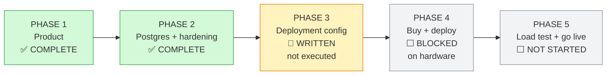

# 06 — Status and Roadmap

**Last updated: 2026-08-29.**

The honest picture. Anything marked ✅ has been run and the output is quoted;
anything marked 📝 is written but not executed; anything marked ❌ does not
exist.

---

## Where the project stands



**The one thing blocking progress: the servers are not bought.** Everything that
can be done without hardware is done.

---

## ✅ Phase 1 — The product (complete)

| Feature | State | Proven by |
|---|---|---|
| Roles, modules, access grid, per-user overrides | ✅ | `smoke.sh`: full 7 × 16 matrix |
| Academic years and terms | ✅ | `ui-test` |
| Classes, students, assignments | ✅ | `ui-test` |
| Student CSV import, two-pass with reasons | ✅ | `ui-test` (7 checks) |
| Daily attendance register | ✅ | `ui-test` |
| **Attendance by period** | ✅ | `period-test` (16 checks) |
| **Quick attendance (PIN, no full sign-in)** | ✅ | `quick-test` (20 checks) |
| **School day / periods admin** | ✅ | `period-test` |
| Observations | ✅ | `ui-test` |
| Staff tasks | ✅ | `smoke.sh` |
| Reports + CSV + Excel | ✅ | `ui-test`, `period-test` |
| Student profiles with visibility rules | ✅ | `ui-test` (4 checks) |
| Audit trail | ✅ | `ui-test` (4 checks) |
| Arabic default + English, RTL | ✅ | `test:i18n`, rendered `lang="ar" dir="rtl"` |

### Test results, 2026-08-29, against PostgreSQL 16

Run twice: against the dev server, **and against the production build** — the
artefact that actually ships. That second run is where four real defects were
found that development had hidden.

```
                          dev      production build
npm run test          →   4/4      4/4     (rate limiting)
npm run test:i18n     →   10/10    10/10   (dictionaries in step)
bash scripts/smoke.sh →   matrix correct   (7 roles × 16 pages)
npm run test:ui       →   40/40    40/40
npm run test:periods  →   16/16    16/16
npm run test:quick    →   20/20    20/20
npx tsc --noEmit      →   clean
npm run build         →   succeeds
docker build          →   succeeds, 474 MB, runs as uid 1001
```

---

## ✅ Phase 2 — Postgres and production hardening (complete)

| Item | State | Note |
|---|---|---|
| PostgreSQL in every environment | ✅ | Was SQLite locally / Turso hosted |
| Real Prisma migration history | ✅ | `20260828180802_init` |
| libSQL/Turso removed | ✅ | Two dependencies dropped |
| Production image (multi-stage, non-root) | ✅ | 474 MB, runs as uid 1001 |
| `/api/health` (liveness + readiness) | ✅ | Verified: `{"status":"ok","database":"up"}` |
| Startup config guard | ✅ | Verified refusing 3 bad configs |
| Security headers + CSP | ✅ | Set by the app, HSTS by nginx |
| `.env` untracked from git | ✅ | Was committed despite `.gitignore` |

### Startup guard — verified refusing bad configuration

```
$ docker run ... -e NODE_ENV=production -e AUTH_SECRET="dev-secret-change-me-..."
  EduPlus Connect cannot start — configuration is invalid:
    • AUTH_SECRET is still the example value from .env.example. Anyone who has
      read the repository could mint an administrator session.

$ docker run ... -e SCHOOL_TIMEZONE="Asia/Bahrainn"
  EduPlus Connect cannot start — configuration is invalid:
    • SCHOOL_TIMEZONE "Asia/Bahrainn" is not a valid IANA timezone

$ docker run ... (valid configuration)
  [startup] EduPlus Connect ready — production, school timezone Asia/Bahrain
  {"status":"ok","database":"up","latencyMs":50}
```

---

## 📝 Phase 3 — Deployment configuration (written, not executed)

Every file exists and is reviewed. **None has been run on a real server.**

| Artefact | File | State |
|---|---|---|
| Production image | `Dockerfile` | ✅ builds and runs |
| App tier compose | `deploy/app/docker-compose.yml` | 📝 |
| DB tier compose | `deploy/db/docker-compose.yml` | 📝 |
| nginx (TLS, rate limit, LB) | `deploy/app/nginx/eduplus.conf` | 📝 |
| Postgres tuning | `deploy/db/postgresql.conf` | 📝 |
| Backup + verify + rotate + offsite | `deploy/db/backup.sh` | 📝 |
| Server hardening | `deploy/bootstrap-server.sh` | 📝 |
| Local dev database | `docker-compose.dev.yml` | ✅ in use |

> 📝 means: written carefully, commented, reviewed — and still unproven. The
> first run will surface something. That is expected, and it is why Phase 4 has
> a verification step after every phase rather than at the end.

---

## ⬜ Phase 4 — Purchase and deploy (blocked on hardware)

Ordered, with the gate that must pass before moving on:

| # | Step | Gate |
|---|---|---|
| 1 | Buy 2 VPS, record real specs into [03](03-infrastructure.md) | Specs written down |
| 2 | Buy domain, point A record at app server | `dig` resolves |
| 3 | Run `bootstrap-server.sh` on both | `ufw status` correct; SSH key-only |
| 4 | Configure WireGuard | `ping 10.10.10.2` succeeds |
| 5 | Start the database tier | **`nc -zv <public-ip> 5432` FAILS from outside** |
| 6 | Certificate, migrate, start the app tier | `/api/health` green over HTTPS |
| 7 | `seed-production.ts` | Administrator can sign in |
| 8 | Manual walkthrough | Class → students → assign → take a register |
| 9 | Configure offsite backups | A dump appears in object storage |
| 10 | **Restore rehearsal** | Row counts match on a scratch database |

Step 5's gate is written as a *failure* deliberately: the check is that the
database is unreachable, and it is the one mistake in this design that would
matter most.

---

## ⬜ Phase 5 — Load test and go live (not started)

| Step | Note |
|---|---|
| Write the k6 burst scenario | Plan in [05 — Capacity](05-capacity.md#the-load-test-that-must-happen) |
| Run it against staging | Never against real school data |
| Replace estimates with measurements | [05](05-capacity.md) is currently guesswork with reasoning |
| External uptime monitor on `/api/health` | Nobody watches a dashboard at 2am |
| Migrate or re-enter the school's data | Decision pending — see below |
| Train the administrator | |
| Go live | |

---

## Defects found and fixed

Recorded because how they were found matters more than that they were fixed.

| # | Defect | How it surfaced | Severity |
|---|---|---|---|
| 1 | **The test harness scored every blocked page as passing.** `smoke.sh` and `ui-test.ts` judged refusal by HTTP status, but the dev server answers a refusal with 200. Four access-control checks had been silently failing. | Noticed that a parent showed `ok` for `/users` | **High** — would have hidden a real access regression |
| 2 | **Two different definitions of "today."** `today()` used the server's local clock; the future-date guards used UTC. Neither was the school's. On a Bahrain deployment this refuses a valid register between midnight and 03:00. | The suite failed at 01:00 local | **Medium** — a daily 3-hour window of breakage |
| 3 | **A function passed from a Server Component to a Client Component.** RSC cannot serialise it; the page still returned 200, so it looked fine under curl. | New `period-test` caught it | Medium |
| 4 | **Search would have silently broken on Postgres.** Six `contains` filters had no `mode: "insensitive"`. SQLite matches case-insensitively; Postgres does not. Searching "ahmed" would stop finding "Ahmed" — with no error. | Found by auditing before the port | **High** — silent data-visibility bug |
| 5 | **`.env` was tracked in git** despite being in `.gitignore`, so the Turso token is in the repository history. | Noticed while staging a commit | **High** — see below |
| 6 | The seed wrote no register at weekends, so the demo dashboard read blank and the suite could not pass on a Saturday. | The suite failed on a Saturday | Low |
| 7 | The denied page had an untranslated English paragraph and an unused `denied.body` key. | Reading the page while fixing #1 | Low |
| 8 | **Every confirmation message was invisible in production.** A Server Action that revalidates hands React a new RSC payload with its result; React replaces the form's subtree before the returned state is ever committed. Add an observation → the row is written, the teacher is told *nothing* → they add it again. Worked in development, so it had never been seen. | Running the suites against the **production build** for the first time | **High** — silent duplicate data entry |
| 9 | A dev-only CSP mistake blocked all client JavaScript (Next's dev server needs `unsafe-eval`), which presented as every form silently failing. | Introduced and caught within the same session | Medium |
| 10 | **"Finish" did not sign a shared device out.** The quick-attendance cookie is scoped to `/quick`; deleting it by name alone targets path `/`, so it survived — leaving the next teacher to pick up the tablet signed in as the previous one. | `quick-test` | **High** for a shared device |

### What made #8 findable

Development and production were never behaving the same, and only one of them
was being tested. The suites now run against the production build as well, and
that single change surfaced four separate defects in one afternoon — #8 above,
the CSP mistake, a term chip that does not navigate, and two test checks that
were passing for the wrong reason.

**Do not accept "green in dev" as evidence again.** `npm run build && npx next
start` then point the suites at it.

### Quick attendance: what its tests actually assert

It is the one page reachable without signing in, so the suite is mostly
negative checks — the things that must NOT happen:

```
  PASS  no student name is on the page before the PIN
  PASS  only teachers with a PIN are listed
  PASS  the register bounces back without a PIN
  PASS  a wrong PIN is refused
  PASS  every row is attributed to the teacher who signed in
  PASS  another teacher's class is not offered
  PASS  nothing was written to another teacher's class
  PASS  a quick session cannot open /dashboard, /students, /users, /period-reports
  PASS  finishing signs the device out
```

That last one was a real defect when first written: the cookie is scoped to
`/quick`, and deleting it by name alone targets path `/`, so "Finish" left the
previous teacher signed in on a shared classroom device.

### Fixed by moving the message out of React's tree

Confirmations are now raised as a toast appended to `<body>` (`src/components/toast.ts`)
at the moment the action resolves — not from component state, which a re-render
can discard, and not from an effect, which never runs if the component is
replaced first.

### ⚠️ Outstanding security item

**The Turso auth token is in the git history** (commit `4c128e4 "Create .env"`).
The file is untracked now and the application no longer uses Turso at all, but
**history cannot be un-published by untracking**.

**Required action, by the repository owner:**

1. Revoke the token in the Turso console. *(Not done — requires account access.)*
2. The repository is private, which limits exposure, but treat the token as
   compromised regardless.

---

## Known limitations

Deliberate, and worth stating so nobody discovers them as surprises.

| Limitation | Impact | Upgrade path |
|---|---|---|
| **Periods are the same every weekday** | A school with a short Friday cannot express it | Add a weekday column to `Period`; the UI already groups by day |
| **No high availability** | App server dies → site down until rebuilt | Second app server + a load balancer |
| **RPO up to 24 hours** | A crash could lose a day of registers | **Enable WAL archiving** — the single highest-value upgrade |
| **RTO 1–4 hours** | Manual rebuild and restore | Infrastructure-as-code; a warm standby |
| **Single school per deployment** | Cannot serve two schools | Multi-tenancy touches every query and access check |
| **In-memory login rate limiting** | Correct for one app server; per-replica with four | Redis-backed limiter (seam is clean) |
| **Shared vCPU** | Latency varies with neighbours | Move the app tier to dedicated CPU first |
| **No email** | No password-reset email; admin resets manually | SMTP + a reset-token flow |
| **Term chips do not navigate in a production build** | On `/reports`, clicking a term chip fetches the new page and never commits the navigation — a Next App Router behaviour for a same-route link that changes only the query string. The date fields still work, and the URL is correct if opened directly. | Reproduced with the CSP disabled, so it is not caused by the headers. Convert the chips to a form submit, or set the range through the existing date inputs. Confirmed pre-existing, not introduced by the Postgres work. |

---

## Open decisions

Needing the owner, not the engineer:

| # | Decision | Why it matters |
|---|---|---|
| 1 | **Migrate the existing Turso data, or start fresh?** The hosted database holds a real school (one administrator + the current academic year). | Determines whether a Turso→Postgres migration script is needed before go-live. **Still unanswered.** |
| 2 | Confirm the school's size | [05 — Capacity](05-capacity.md) is sized on assumptions |
| 3 | Domain name | Needed for the certificate and `SERVER_NAME` |
| 4 | Offsite backup provider | Contabo Object Storage, Backblaze B2, S3 |
| 5 | Confirm `Asia/Bahrain` is the school's timezone | Decided earlier; confirm against the actual school |

---

## Roadmap after go-live

| Priority | Item | Why |
|---|---|---|
| 1 | **WAL archiving** | Turns 24-hour data loss into minutes. Highest value per effort. |
| 2 | **Quarterly restore rehearsal** | A backup that has never been restored is a rumour |
| 3 | Load test with real numbers | Replace the estimates in [05](05-capacity.md) |
| 4 | Error tracking (Sentry or similar) | Currently errors are only in container logs |
| 5 | Per-weekday periods | The most likely real feature request |
| 6 | Email (password reset, absence notification) | The most likely parent-facing request |
| 7 | Second app server + HA | When one school becomes several |
